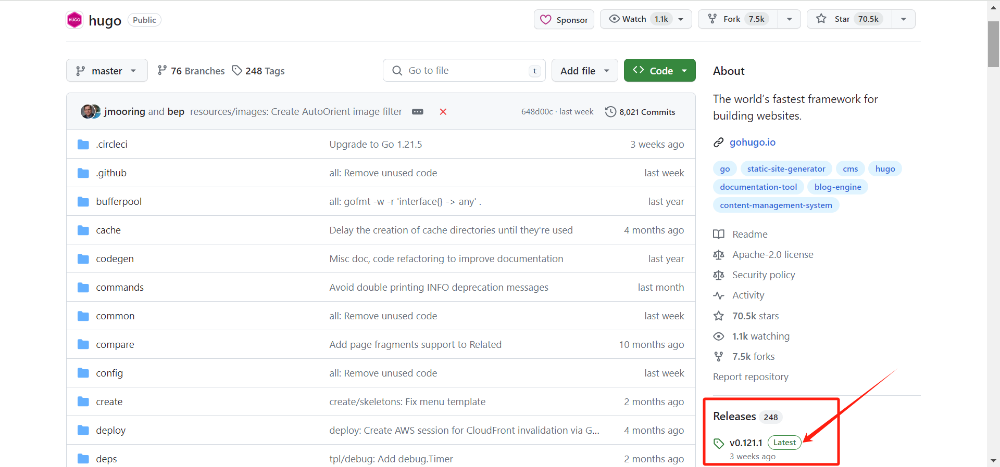
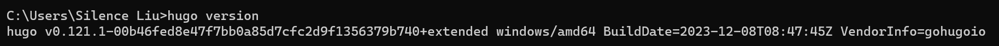
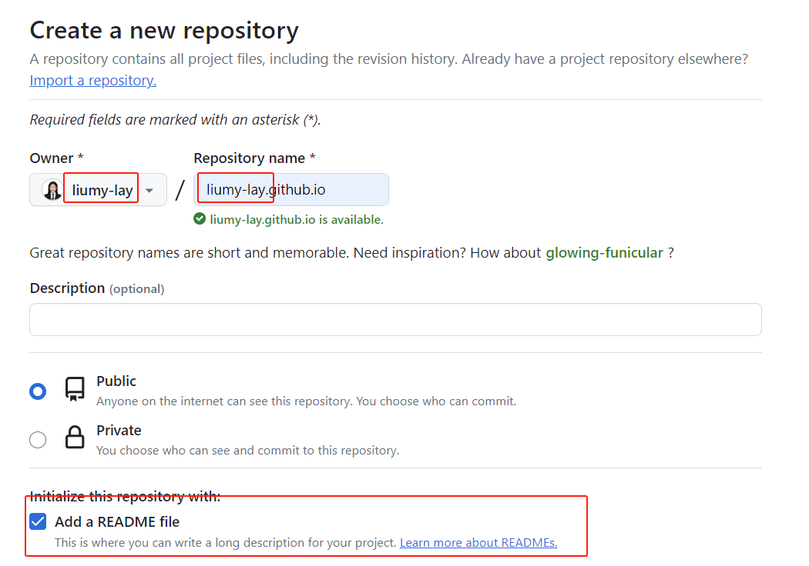
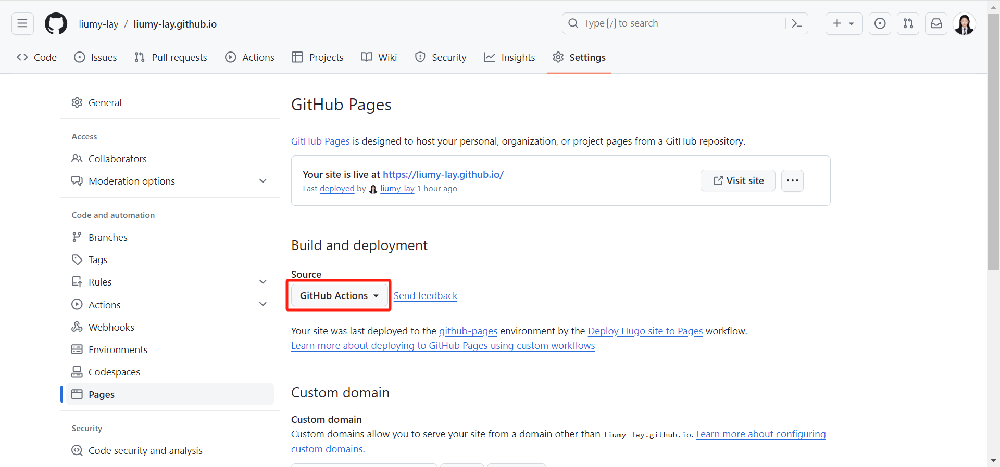
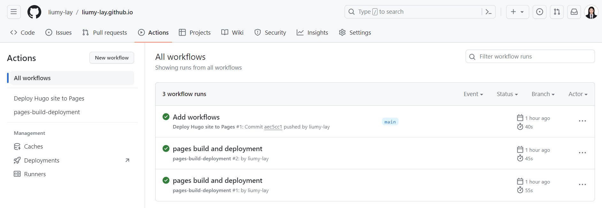

+++
title = 'Hugo+Github Pages搭建个人博客'
date = 2023-12-28T20:42:30+08:00
draft = false

+++

## 前言

1. [创建 GitHub 帐户](https://github.com/signup)

2. [安装git](https://git-scm.com/book/en/v2/Getting-Started-Installing-Git)，下载对应系统版本 exe ，无脑点击下一步。

3. [安装hugo(extended edition, v0.112.0 or later)](https://gohugo.io/installation/)

   - 打开 Github 中的 [Hugo](https://github.com/gohugoio/hugo) 库，打开右边侧边栏About下面的 Realeases，下载最新的版本，本次下载为：[hugo_extended_0.121.1_windows-amd64.zip](https://github.com/gohugoio/hugo/releases/download/v0.121.1/hugo_extended_0.121.1_windows-amd64.zip)

     

   - 解压后，将其中的 hugo.exe 放到指定的安装目录，比如 D:\softwares\Hugo\bin，然后将该目录添加到系统环境变量（win+R → sysdm.cpl → 高级 → 环境变量 → 系统变量 Path）的 Path 下。

   - 打开命令行，输入 `hugo version`，显示版本号即为安装成功

     

## 在几分钟内利用hugo快速发布自己的个人博客

### 快速开始

使用Git Bash**依次**输入以下命令，即可建立预览一个[PaperMod主题](https://adityatelange.github.io/hugo-PaperMod/)的hugo网站：

```bash
hugo new site myblog
cd myblog
git init
git submodule add --depth=1 https://github.com/adityatelange/hugo-PaperMod.git themes/PaperMod
echo "theme = 'PaperMod'" >> hugo.toml
hugo server
```

通过终端中显示的 URL 查看您的站点。按此按钮`Ctrl + C`可停止 Hugo 的开发服务器。

### 命令解释

在目录中为您的博客创建一个以`myblog`命名的文件夹[目录结构](https://gohugo.io/getting-started/directory-structure/)

```text
hugo new site myblog
```

将当前目录更改为博客的根目录。

```text
cd myblog
```

在当前目录中初始化一个空的 Git 存储库。

```text
git init
```

将[PaperMod主题](https://adityatelange.github.io/hugo-PaperMod/)克隆到博客目录结构中，并将其作为[Git 子模块](https://git-scm.com/book/en/v2/Git-Tools-Submodules)`themes`添加到您的博客中。

```text
git submodule add --depth=1 https://github.com/adityatelange/hugo-PaperMod.git themes/PaperMod
```

在博客配置文件`hugo.toml`(位于根目录)中添加一行，表明为`PaperMod`主题。

```text
echo "theme = 'PaperMod'" >> hugo.toml
```

启动Hugo的开发服务器来预览博客。

```text
hugo server
```

按此按钮`Ctrl + C`可停止预览博客。

### 添加内容

向您的网站添加新页面。

```text
hugo new posts/文章标题/index.md
# posts为你文章存储的文件夹名，可任取
# 默认生成路径为content/posts/文章
```

为什么使用这个路径来存放文章，见这篇文章链接：

使用任意文本编辑器打开文件`my-first-post.md`，可以看到默认内容为：

```text
---
title: "My First Post"
date: 2022-11-20T09:03:20-08:00
draft: true
---
```

请注意`draft`中的值为true，代表草稿状态。默认情况下，Hugo 在您构建网站时不会发布草稿内容。

```text
---
title: "My First Post"
date: 2022-11-20T09:03:20-08:00
draft: true
---
## Introduction

This is **bold** text, and this is *emphasized* text.

Visit the [Hugo](https://gohugo.io) website!
```

保存文件，然后启动Hugo的开发服务器来预览博客。您可以运行以下任一命令来预览草稿内容。

```text
hugo server --buildDrafts
hugo server -D
```

通过终端中显示的 URL 查看您的博客。当您继续添加和更改内容时，请保持开发服务器运行。

由于 Hugo 默认开启了热加载功能，所以我们不需要中断已启动的 Hugo 服务，可以在另外一个终端窗口的当前目录下执行其他操作或者修改文章，这些修改后的文章会自动在网页上实时渲染，这样你就可以同步实时观察修改后的网页效果。

### 配置网站

使用编辑器打开项目根目录中的[博客配置](https://gohugo.io/getting-started/configuration/)文件 ( `hugo.toml`)。

```text
baseURL = 'https://example.org/'
languageCode = 'en-us'
title = 'My New Hugo Site'
theme = 'PaperMod'
```

进行以下更改：

1. 为您的网站设置`baseURL`。该值必须以协议开头并以斜杠结尾，如上所示。
2. 设置`languageCode`为您的语言和区域（中文简体为`zh-CN`）。
3. 为您的网站设置标题`title`。

启动 Hugo 的开发服务器以查看您的更改，请记住包含草稿内容。

```text
hugo server -D
```

### 发布网站

在此步骤中，您将**发布**您的网站，但不会**部署**它。

当您**发布**`public`站点时，Hugo 在项目根目录的目录中创建整个静态站点。这包括 HTML 文件以及图像、CSS 文件和 JavaScript 文件等资产。

当您发布网站时，您通常不希望包含[草稿、未来或过期的内容](https://gohugo.io/getting-started/usage/#draft-future-and-expired-content)。命令很简单：

```text
hugo
```

## 在互联网上利用Github Pages部署个人博客

GitHub 通过 GitHub Pages 服务直接从 GitHub 存储库通过 SSL 为个人、组织或项目页面提供免费、快速的静态托管，并自动化开发工作流程并使用 GitHub Actions 进行构建。

### Step1.创建Github存储库。

注意库名必须以用户名开头，例如：我的用户名是liumy-lay，则库名为liumy-lay.github.io




### Step2.将本地存储库推送到 GitHub

- 报错：由于生成本地`git`库的分支默认是`master`，而`github`库默认分支为`main`，因此`git pus`h时会出现各种报错

- 解决：将本地分支改名为`main`，重新`git push`会报`fatal`，根据`fatal`提示内容强制推送即可解决。

- ```bash
  $ git remote add origin git@github.com:liumy-lay/liumy-lay.github.io.git # 将本地git库与远程Github库建立联系
  $ git add .
  $ git commit -m 'first commit' 
  $ git push origin main
  error: src refspec main does not match any
  error: failed to push some refs to 'github.com:liumy-lay/liumy-lay.github.io.git'
  $ git branch -M main # 将当前分支改名为main
  $ git branch -a # 可以查看当前所有分支，此命令非必要
  $ git push origin
  fatal: The current branch main has no upstream branch.
  To push the current branch and set the remote as upstream, use git push --set-upstream origin main
  $ git push --set-upstream origin main --force #强制推送合并分支
  Enumerating objects: 32, done.
  Counting objects: 100% (32/32), done.
  Delta compression using up to 16 threads
  Compressing objects: 100% (24/24), done.
  Writing objects: 100% (32/32), 49.14 KiB | 137.00 KiB/s, done.
  Total 32 (delta 5), reused 0 (delta 0), pack-reused 0
  remote: Resolving deltas: 100% (5/5), done.
  To github.com:liumy-lay/liumy-lay.github.io.git
   + b899144...23b296b main -> main (forced update)
  branch 'main' set up to track 'origin/main'.
  ```

### Step3.访问您的 GitHub 存储库，从主菜单中选择设置 > 页面。在屏幕中央，将源更改为`GitHub Actions`。改变是立竿见影的；您不必按“保存”按钮。



### Step4.在本地存储库中根目录下创建一个空文件`.github/workflows/hugo.yaml`。

### Step5.将下面的 YAML 复制并粘贴到您创建的文件中。根据需要更改分支名称和 Hugo 版本。

```yaml
# Sample workflow for building and deploying a Hugo site to GitHub Pages
name: Deploy Hugo site to Pages

on:
  # Runs on pushes targeting the default branch
  push:
    branches:
      - main # 分支名称默认为main

  # Allows you to run this workflow manually from the Actions tab
  workflow_dispatch:

# Sets permissions of the GITHUB_TOKEN to allow deployment to GitHub Pages
permissions:
  contents: read
  pages: write
  id-token: write

# Allow only one concurrent deployment, skipping runs queued between the run in-progress and latest queued.
# However, do NOT cancel in-progress runs as we want to allow these production deployments to complete.
concurrency:
  group: "pages"
  cancel-in-progress: false

# Default to bash
defaults:
  run:
    shell: bash

jobs:
  # Build job
  build:
    runs-on: ubuntu-latest
    env:
      HUGO_VERSION: 0.121.0 # Hugo版本号
    steps:
      - name: Install Hugo CLI
        run: |
          wget -O ${{ runner.temp }}/hugo.deb https://github.com/gohugoio/hugo/releases/download/v${HUGO_VERSION}/hugo_extended_${HUGO_VERSION}_linux-amd64.deb \
          && sudo dpkg -i ${{ runner.temp }}/hugo.deb          
      - name: Install Dart Sass
        run: sudo snap install dart-sass
      - name: Checkout
        uses: actions/checkout@v4
        with:
          submodules: recursive
          fetch-depth: 0
      - name: Setup Pages
        id: pages
        uses: actions/configure-pages@v4
      - name: Install Node.js dependencies
        run: "[[ -f package-lock.json || -f npm-shrinkwrap.json ]] && npm ci || true"
      - name: Build with Hugo
        env:
          # For maximum backward compatibility with Hugo modules
          HUGO_ENVIRONMENT: production
          HUGO_ENV: production
        run: |
          hugo \
            --gc \
            --minify \
            --baseURL "${{ steps.pages.outputs.base_url }}/"          
      - name: Upload artifact
        uses: actions/upload-pages-artifact@v2
        with:
          path: ./public

  # Deployment job
  deploy:
    environment:
      name: github-pages
      url: ${{ steps.deployment.outputs.page_url }}
    runs-on: ubuntu-latest
    needs: build
    steps:
      - name: Deploy to GitHub Pages
        id: deployment
        uses: actions/deploy-pages@v3
```

### Step6.使用“Add workflows”之类的提交消息将更改提交到本地存储库，然后推送到 GitHub。

```bash
$ git add .
$ git commit -m 'Add workflows' 
$ git push origin 
Enumerating objects: 6, done.
Counting objects: 100% (6/6), done.
Delta compression using up to 16 threads
Compressing objects: 100% (3/3), done.
Writing objects: 100% (5/5), 1.32 KiB | 1.32 MiB/s, done.
Total 5 (delta 1), reused 0 (delta 0), pack-reused 0
remote: Resolving deltas: 100% (1/1), completed with 1 local object.
To github.com:liumy-lay/liumy-lay.github.io.git
   23b296b..aec5cc1  main -> main
```

### Step7.从 GitHub 的主菜单中，选择**Actions**。

当 GitHub 完成站点的构建和部署后，状态指示器的颜色将变为绿色。在部署步骤下，您将看到指向您的实时站点的链接。

将来，每当您从本地存储库推送更改时，GitHub 都会重建您的站点并部署更改。



## 总结

日常发布文章命令

```bash
$ hugo new [posts]/[name]/index.md
$ hugo server -D
$ hugo
$ git status
$ git add .
$ git commit -m '[描述信息]'
$ git push origin
```

参考资料：

https://gohugo.io/getting-started/quick-start/

https://gohugo.io/hosting-and-deployment/hosting-on-github/

