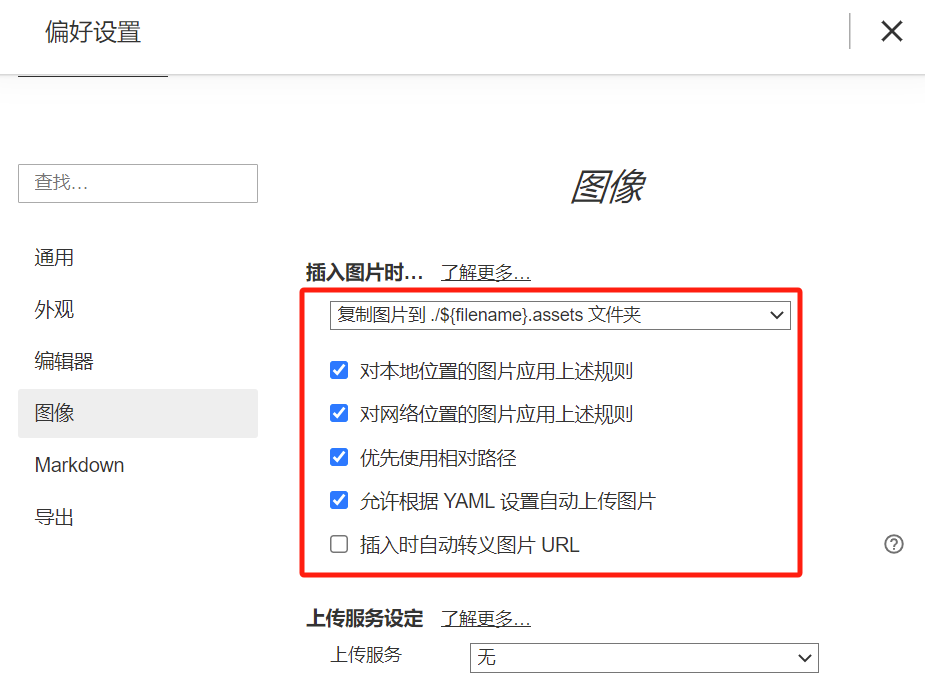
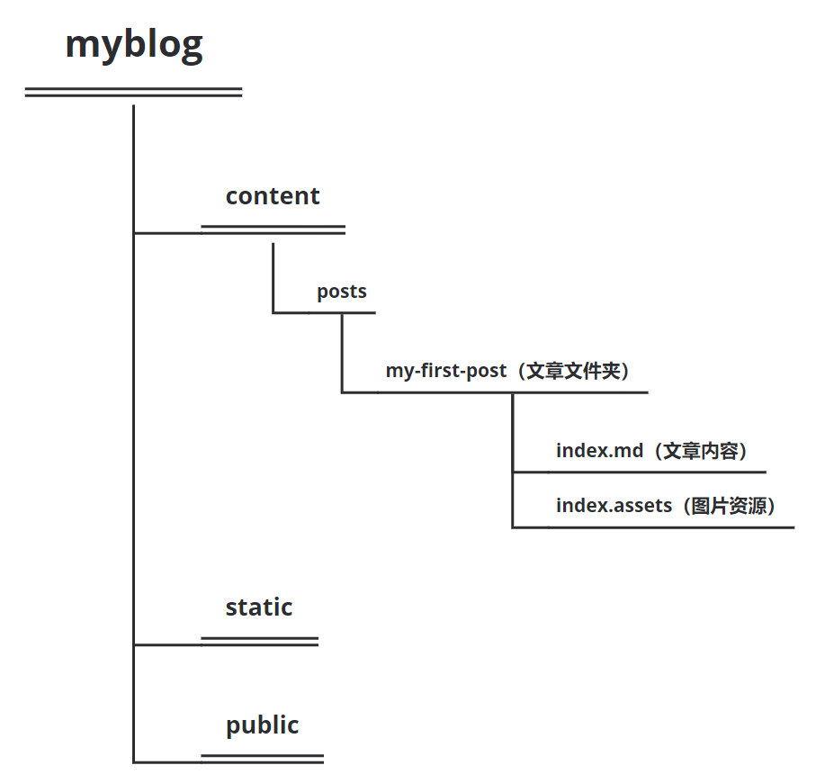

+++
title = 'Typora与hugo图片路径引用设置问题'
date = 2023-12-30T16:00:30+08:00
draft = false

+++

使用Typora插入的图片路径与Hugo的默认图片寻找路径往往无法统一，导致不能让图片在Typora和Hugo网站上同时显示。

**解决办法：**

1. 创建文章时，设置路径为：

```bash
hugo new 一级目录/文章标题/index.md
```

注意：markdown文件必须以`index`命名

2. 打开Typora-文件-偏好设置-图像，设置为如下图：

**原因解释：**

我们先来了解以下Hugo是如何引用图片的：

Hugo博客的根目录有一个`static`目录，这个`static`目录就是用来存放一些静态文件，比如图片、css、js文件等。

执行`hugo`命令的时候，会把`static`目录下的子目录或文件复制到`public`目录下。比如在`static`下添加一个`img`子目录，并且在`img`子目录存放图片，那执行`hugo`命令后，就会把`static\img`文件的内容拷贝到`public\img`里面。

而Hugo博客网站展示的其实是`public`下的内容，因此markdown文章里引用图片的时候，就得引用`pubic`下的图片才可以。

**因此常规的解决方法就是**

1.在`static`目录下创建`img`子目录，把markdown要使用的图片放在`static\img`目录里。

2.在markdown文件里，按照如下格式引用图片(这里假设图片名称叫wechat.png)。这样最终public目录下生成的静态页面就可以引用到`public\img`下的图片了。

**但是这里就遇到了两个问题：**

1. Typora里图片路径没办法显示，因为Typora是相对路径显示图片。
2. 导致markdown文件与其引用的照片资源分离，所有文章的图片都集中在了一个文件夹里，当需要删除和替换特定文章内的图片时，检索时就很困难。

因此，我们选择为每篇文章建立一个文件夹，将图片资源放在这个文件夹下。并且在为Typora设置好图片路径以后，此时只要你拖动照片到markdown文章时，Typora会自动帮你创建文件夹与copy一份照片到指定文件夹的目录下。



